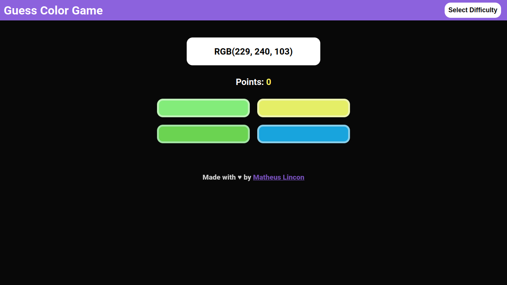
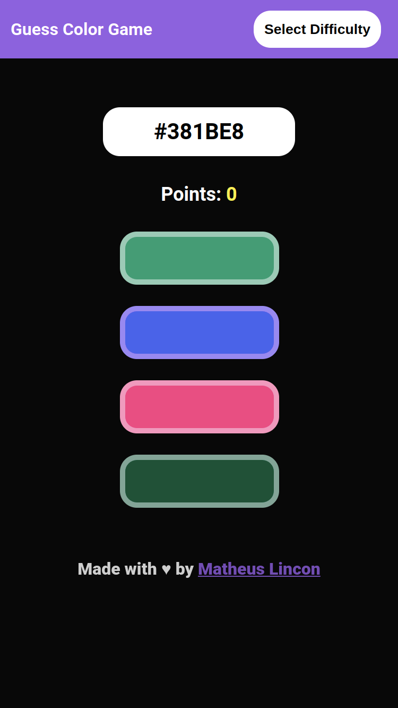

# Guess Color Game :art:

## Sobre o projeto :information_source:

- Esse projeto é um jogo bastante simples, onde consiste em você tentar adivinhar qual é a cor que está escrita em um visor.
   
- As cores podem variar em três tipos: Nome, RGB e HEX. Cada tipo representa uma dificuldade. Nome: fácil, RGB: médio e HEX: difícil. Cada dificuldade pode ser selecionada através de um menu.

---

## Objetivos :dart:

- Meu objetivo com esse projeto foi entender melhor:
  - Manipulação dos elementos na DOM;
  - Criação de menu;
  - Melhor utilização do menu no mobile;
  - Eventos de `touchstart`, `mousemove`...

---

## Tecnologias :wrench:

- As tecnologias usadas no projeto foram:
  - HTML;
  - CSS;
  - JavaScript.

---

## Preview :computer:

> Acesse a página aqui e divirta-se!
> [**Guess Color Game**](https://matheus-lincon.github.io/guess-color-game/)

---
